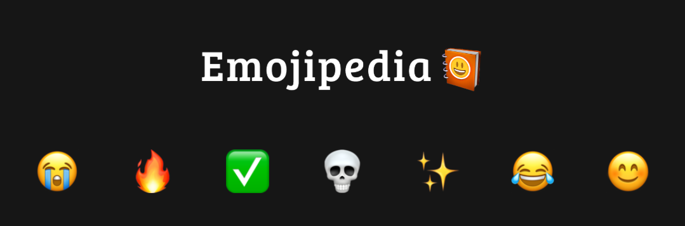

#  iOS Emojis for Browsers  

**Professional-grade Apple emojis for Chrome/Firefox**  

  
  
  *Inspired by premium emoji experiences like Emoipedia*  

##  Features
- **Authentic iOS 17** emoji designs
- **Seamless integration** - works on all sites
- **Lightweight** (<100KB memory)
- **Privacy-focused** - no tracking

## 🛠 Developer Installation

1. Download this repo
2. Open Chrome/Firefox → `chrome://extensions`
3. Enable "Developer mode" 
4. Click "Load unpacked" → select extension folder

Proprietary Software
© 2024 [Your Name]. All rights reserved.
Redistribution prohibited without permission.

